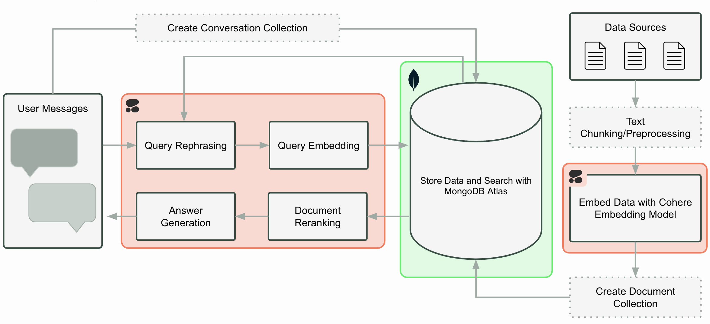

# Cohere Quickstart

This repository contains a demo application showcasing the integration with Cohere. Below is a detailed explanation of the contents, architecture, and instructions on how to run the application.

## Architecture Diagram



The architecture diagram above illustrates the flow and components of the application:

1. **User Interface (UI)**: The main entry point of the application is `ui.py`. This script handles user interactions and displays the results.
2. **Backend Processing**: The backend processes the data received from the UI, interacts with the Cohere API, and returns the processed results.

## Running the Application

To run the application, follow these steps:

1. **Clone the Repository**:
    ```bash
    git clone https://github.com/mongodb-partners/MongoDB_Cohere.git
    cd Cohere-demo
    ```

2. **Install Dependencies**:
    Ensure you have Python installed. Then, install the required packages:
    ```bash
    pip install pymongo python-dotenv cohere streamlit
    ```

3. **Set Up Environment Variables**:
    Create a `.env` file in the root directory and add the necessary environment variables:
    ```plaintext
    COHERE_API_KEY = <COHERE_API_KEY>
    HF_TOKEN = <HUGGING_FACE_TOKEN>
    MONGO_URI = <MONGODB_URI>
    ```

4. **Run the Application**:
    Execute the main file to start the application:
    ```bash
    streamlit run ui.py
    ```

## Environment Variables

The application uses the following environment variables, which should be defined in the `.env` file:

- `COHERE_API_KEY`: Your API key for accessing Cohere's services.
- `HF_TOKEN`: Your Hugging Face token for accessing Hugging Face's services.
- `MONGO_URI`: The URI for connecting to your MongoDB database.

## Conclusion

This README provides a comprehensive guide to understanding and running the Cohere demo application. For any issues or contributions, please refer to the repository's issue tracker or submit a pull request.
